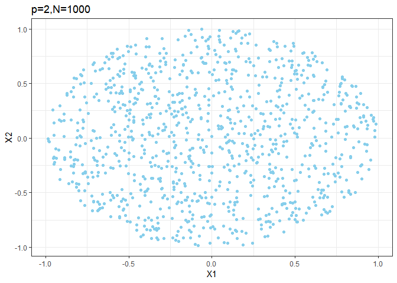
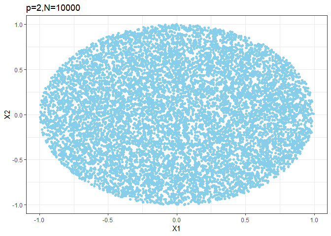

Curse of Dimensinality
================
2019년 3월 11일

``` r
devtools::install_github("AckerDWM/gg3D")
```

    ## Skipping install of 'gg3D' from a github remote, the SHA1 (ffdd837d) has not changed since last install.
    ##   Use `force = TRUE` to force installation

``` r
library("gg3D")
```

    ## Loading required package: ggplot2

``` r
library(ggplot2)
library(plotly)
```

    ## 
    ## Attaching package: 'plotly'

    ## The following object is masked from 'package:ggplot2':
    ## 
    ##     last_plot

    ## The following object is masked from 'package:stats':
    ## 
    ##     filter

    ## The following object is masked from 'package:graphics':
    ## 
    ##     layout

``` r
# install.packages("webshot")
webshot::install_phantomjs()
```

    ## phantomjs has been installed to C:\Users\jeeyeon\AppData\Roaming\PhantomJS

### 1번 공식

``` r
    myequ = function(n,p){
      return( (1 -(1/2)^(1/n))^(1/p) )
    }
```

### 2번 함수 - My Function

``` r
    myftn = function(n,p){
      ### 1. 데이터수 n, 차원 p 에서 단위가 1 인 벡터 만들기 
      mymat = matrix( rnorm(n*p,0,1), nrow = n, ncol = p )
      mymat = mymat / apply(mymat, 1, function(x) { sqrt(sum(x^2)) })
      ### 2. u ~ unif(0,1) 생성해서 위에서 생성한 단위벡터들의 값들에 u^(1/p) 곱해주기 
      # (그럼 그 벡터들의 크기가 됨)
      mymat * (runif(n,0,1))^(1/p)
    }

### Graph 
    # p = 2
    ggplot(data.frame( myftn(1000,2) ) , aes(x=X1, y=X2)) + 
      geom_point(color = "sky blue") + theme_bw() + ggtitle("p=2,N=1000")
```



``` r
    ggplot(data.frame( myftn(10000,2) ) , aes(x=X1, y=X2)) + 
      geom_point(color = "sky blue") + theme_bw() + ggtitle("p=2,N=10000")
```



``` r
    # p = 3
    mydata = data.frame( myftn(1000,3) )
    plot_ly(x=mydata$X1, y=mydata$X2, z=mydata$X3, type="scatter3d", 
            mode="markers",colors = "sky blue", size = 3) %>% layout(title = "p=3,N=1000")
```


``` r
    mydata = data.frame( myftn(10000,3) )
    plot_ly(x=mydata$X1, y=mydata$X2, z=mydata$X3, type="scatter3d", 
            mode="markers",colors = "sky blue", size = 3)%>% layout(title = "p=3,N=10000")
```


``` r
### 3번 - Compare  if n = 500, p = 3
    
    # equation
    a = c(myequ(100,5), myequ(100,10), myequ(100,20))
    b = c(myequ(1000,5), myequ(1000,10), myequ(1000,20))
    c = c(myequ(10000,5), myequ(10000,10), myequ(10000,20))
    
    round(a,4)
```

    ## [1] 0.3697 0.6080 0.7798

``` r
    round(b,4)
```

    ## [1] 0.2334 0.4831 0.6951

``` r
    round(c,4)
```

    ## [1] 0.1473 0.3838 0.6195

``` r
    # generate sample
    temp = c()
    for ( i in 1: 1000) {  
      temp[i] = min( apply(myftn(100,20),1,function(x){ sqrt(sum(x^2)) }) )
    }
    round(median(temp),4)
```

    ## [1] 0.7799

``` r
    temp = c()
    for ( i in 1: 1000) {  
      temp[i] = min( apply(myftn(1000,20),1,function(x){ sqrt(sum(x^2)) }) )
    }
    round(median(temp),4)
```

    ## [1] 0.6959

``` r
    temp = c()
    for ( i in 1: 1000) {  
      temp[i] = min( apply(myftn(10000,20),1,function(x){ sqrt(sum(x^2)) }) )
    }
    round(median(temp),4)
```

    ## [1] 0.6233

``` r
    myf1 = function(p,n){
      res = (10-0.5^(1/n))^(1/p)
      return(res)
    }
    
    myf2 = function(p,n){
      temp1 = runif(n)^(1/p)
      return(min(temp1))
    }
    
    myf3 = function(p,n,sim.n){
      res = rep(0,sim.n)
      for(i in 1:sim.n){
        res[i] = myf2(p,n)
      }
      return(median(res))
    }
```

<!-- ```{r} -->
<!--     p = 10; n =10000; sim.n = 10000 -->
<!--     myf1(p,n) -->
<!--     myf3(p.n,sim.n) -->
<!-- ``` -->
